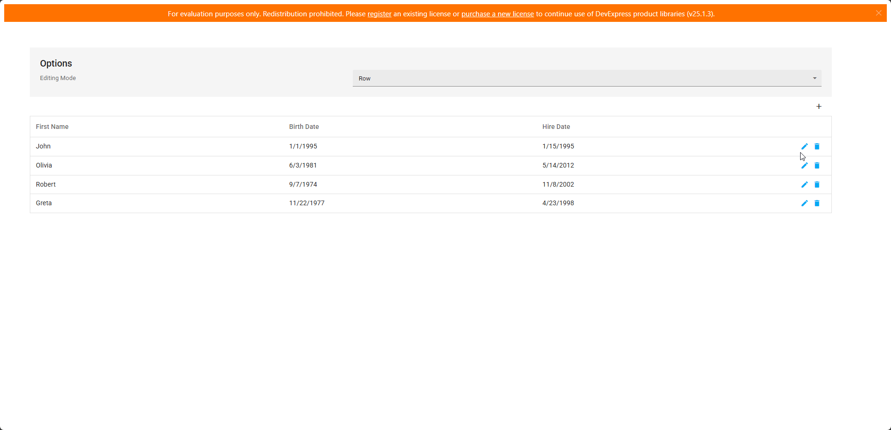

<!-- default badges list -->

<!-- default badges end -->
# DevExtreme DataGrid - Validate an Editor Based on Changes in Another Editor

This example obtains the [Validator](https://js.devexpress.com/Documentation/ApiReference/UI_Components/dxValidator/) instance attached to a data row editor to call [validate()](https://js.devexpress.com/Documentation/ApiReference/UI_Components/dxValidator/Methods/#validate) when another editor changes value. 

## Implementation Details

Use [onEditorPreparing](https://js.devexpress.com/Documentation/ApiReference/UI_Components/dxDataGrid/Configuration/#onEditorPreparing) to override a data row editor's `onValueChanged` handler as follows:

1. Call the initial handler to preserve the default editor functionality.
2. Use the [getCellElement()](https://js.devexpress.com/Documentation/ApiReference/UI_Components/dxDataGrid/Methods/#getCellElementrowIndex_dataField) method to obtain the parent element of another editor.
3. To obtain the Validator instance attached to this editor, use the element returned by `getCellElement()` as follows:
    - **jQuery and ASP.NET Core**: Wrap the element in a jQuery object and call [Validator.instance()](https://js.devexpress.com/Documentation/ApiReference/UI_Components/dxValidator/Methods/#instance).
    - **Angular, Vue, and React**: Pass the element to [Validator.getInstance()](https://js.devexpress.com/Documentation/ApiReference/UI_Components/dxValidator/Methods/#getInstanceelement) as a parameter.

## Files to Review

- **Angular**
    - [app.component.html](Angular/src/app/app.component.html)
    - [app.component.ts](Angular/src/app/app.component.ts)
- **React**
    - [App.tsx](React/src/App.tsx)
- **Vue**
    - [App.vue](Vue/src/App.vue)
    - [Home.vue](Vue/src/components/HomeContent.vue)
- **jQuery**
    - [index.html](jQuery/src/index.html)
    - [index.js](jQuery/src/index.js)
- **ASP.NET Core**    
    - [Index.cshtml](ASP.NET%20Core/Views/Home/Index.cshtml)

## Documentation

- [DataGrid.onEditorPreparing](https://js.devexpress.com/Documentation/ApiReference/UI_Components/dxDataGrid/Configuration/#onEditorPreparing)
- [Validator.getInstance(element)](https://js.devexpress.com/Documentation/ApiReference/UI_Components/dxValidator/Methods/#getInstanceelement)
- [Validator.validate()](https://js.devexpress.com/Documentation/ApiReference/UI_Components/dxValidator/Methods/#validate)

<!-- feedback -->
## Does this example address your development requirements/objectives?

 

(you will be redirected to DevExpress.com to submit your response)
<!-- feedback end -->
